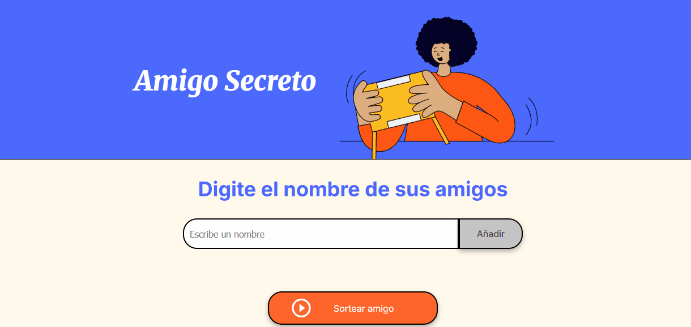

# Challenge Amigo Secreto (Español) Terminado :white_check_mark:

Este proyecto es parte del programa ONE-Alura y consiste en una aplicación para organizar el juego del Amigo Secreto.

## Características :technologist:

- Registro de participantes
- Asignación aleatoria de amigos secretos
- Interfaz amigable en español

## Tecnologías utilizadas 🚀

- [Tecnología principal] (JavaScript)

## Instalación :pushpin:

* Clona el repositorio: 
    ```bash
    git clone https://github.com/JM010/challenge-amigo-secreto.git
    

## Uso :pushpin:
- Ingresar los nombres en el campo.
- Apretar el botón 'añadir' para agregar los nombres a la lista.
- El juego no tomará el valor del campo, si está vacío o si introduce nombres repetidos. 
- Presione el botón de sortear amigos y saldrá el nombre del ganador en letras verdes
- Después de cinco segundos, el juego se reiniciará


## Contribuciones :page_facing_up:

¡Las contribuciones son bienvenidas! Por favor, abre un issue o envía un pull request.


